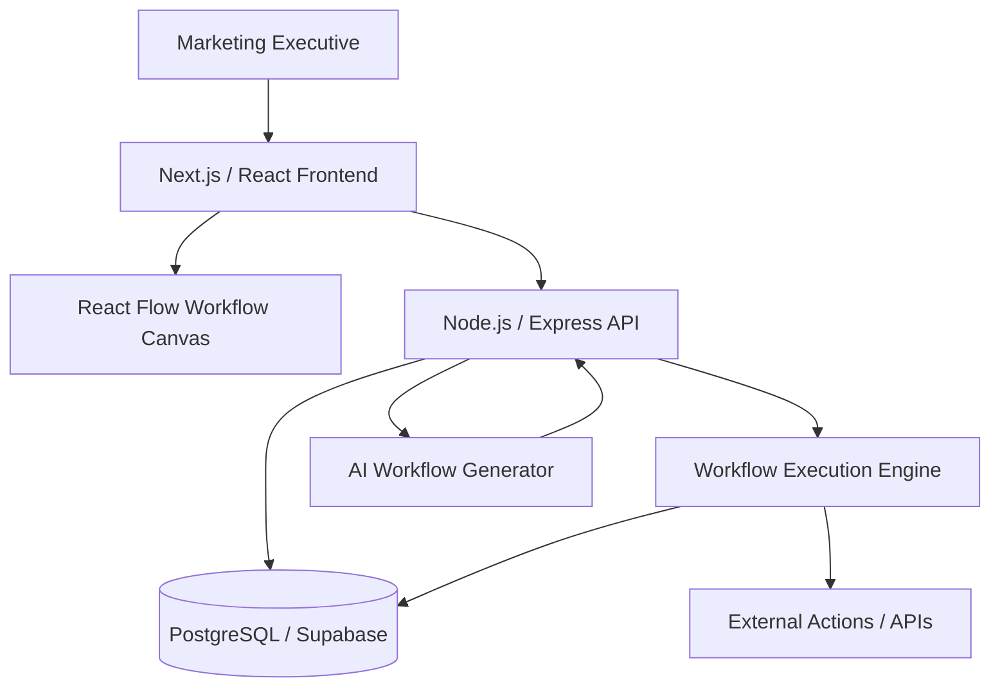

# MARKETFLOW Architecture

## Overview

MARKETFLOW follows a simple client-server architecture.



## Components

### Frontend

Responsible for:

- Dashboard
- Workflow list
- Visual workflow editor
- Node configuration
- Execution monitor
- Logs
- Templates

### Workflow Canvas

React Flow provides:

- Nodes
- Connections
- Drag-and-drop editing
- Visual conditions
- Workflow layout

### Backend API

Responsible for:

- Workflow CRUD
- Validation
- Execution requests
- Execution history
- AI workflow generation
- Database communication

### Workflow Execution Engine

The execution engine traverses the workflow graph and executes each node.

Conceptually:

```text
Load workflow
      ↓
Validate graph
      ↓
Find trigger
      ↓
Execute node
      ↓
Evaluate condition
      ↓
Choose next node
      ↓
Continue
      ↓
Store execution result
```

### Database

Stores:

- Users
- Workflows
- Executions
- Execution steps
- Workflow templates

### AI Layer

The optional AI layer converts a natural-language marketing instruction into a structured workflow definition.

Example:

```text
Natural language
      ↓
AI
      ↓
Structured workflow JSON
      ↓
Validation
      ↓
React Flow canvas
      ↓
Human review
      ↓
Execution
```

## Reliability Principles

1. Validate workflows before execution.
2. Never execute an unknown node type.
3. Record each execution step.
4. Store failures with readable error messages.
5. Do not silently overwrite workflow changes.
6. Keep the AI-generated workflow editable before execution.

## Security

- Secrets live only in environment variables.
- API keys are never committed.
- Passwords, if authentication is implemented, are stored as hashes.
- External actions are allowlisted.
