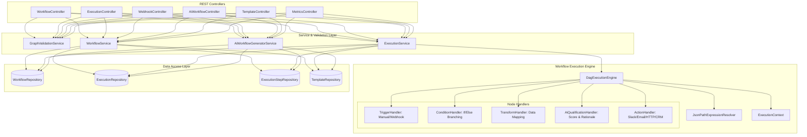

# MARKETFLOW — Spring Boot Backend 10-Phase Implementation Roadmap
**Problem Statement:** ALG-AUTO-01 (Visual Workflow Automation)  
**Target Deadline:** 10:00 PM (Live Deployment & Submission)  
**Technology Stack:** Java 21, Spring Boot 3.3.4, Spring Data JPA, H2 / PostgreSQL, Swagger/OpenAPI 3.0, Maven

---

## Architecture Overview

---

## 10-Phase Backend Breakdown

### Phase 1: Project Scaffolding, Configuration & Environment Setup [COMPLETED]
* **Status:** ✅ Completed & Verified
* **Goal:** Initialize package structure, configurations, dual database profiles, CORS, and Swagger UI.
* **Key Tasks:**
  1. Set up standard Spring Boot directory structure under `backend/src/main/java/com/marketflow`. [✅ Done]
  2. Implement `MarketflowApplication.java` entry point with `@EnableAsync`. [✅ Done]
  3. Create `application.yml` supporting multi-profile setup:
     - `dev`: Local PostgreSQL database (`marketflow` / `postgres`). [✅ Done]
     - `test`: Lightning-fast in-memory H2 database with PostgreSQL compatibility. [✅ Done]
     - `ci`: GitHub Actions pipeline with real PostgreSQL 16 service container. [✅ Done]
     - `prod`: Cloud hosting container configuration. [✅ Done]
  4. Implement `CorsConfig.java` to support requests from Next.js (`localhost:3000`), Vite (`localhost:5173`), and production origins. [✅ Done]
  5. Implement `OpenApiConfig.java` exposing interactive Swagger docs at `/swagger-ui/index.html`. [✅ Done]
  6. Implement unified `ApiResponse<T>` envelope and `GlobalExceptionHandler.java`. [✅ Done]
  7. Multi-stage `backend/Dockerfile` and side-by-side CI/CD workflows (`ci.yml`, `cd.yml`). [✅ Done]
* **Deliverable:** Compilable Spring Boot app that starts cleanly, connects to PostgreSQL, runs fast H2 tests, and shows Swagger UI.

---

### Phase 2: Domain Entities & Data Access Layer (JPA Repositories) [COMPLETED]
* **Status:** ✅ Completed & Verified
* **Goal:** Model the database schema for workflows, executions, steps, and templates.
* **Key Tasks:**
  1. `Workflow`: Stores workflow ID, user ID, name, description, status (`draft`/`active`/`paused`), React Flow definition JSON (nodes and edges), audit timestamps. [✅ Done]
  2. `Execution`: Stores execution ID, workflow relation, execution status (`queued`/`running`/`completed`/`failed`), input payload, final output payload, error message, started/completed timestamps. [✅ Done]
  3. `ExecutionStep`: Stores step-level execution records: `nodeId`, `nodeType`, `stepName`, status (`pending`/`running`/`completed`/`failed`/`skipped`), input payload, output payload, error message, duration in ms. [✅ Done]
  4. `WorkflowTemplate`: Stores pre-packaged marketing workflow templates (e.g. Lead Qualification, Customer Onboarding). [✅ Done]
  5. Create Spring Data JPA repositories: [✅ Done]
     - `WorkflowRepository` (order by updated at, filter by status, count by status)
     - `ExecutionRepository` (order by created at, filter by workflow, count by status)
     - `ExecutionStepRepository` (chronological step logs per execution)
     - `WorkflowTemplateRepository` (filter by category, order by name)
* **Deliverable:** JPA entities auto-generated in DB with full CRUD and cascade queries tested (5/5 unit & integration tests passing).

---

### Phase 3: DTOs, Serialization & Graph Schema Validation
* **Estimated Time:** 15:30 – 16:00
* **Goal:** Define request/response contracts matching frontend React Flow schemas and validate workflow graph integrity.
* **Key Tasks:**
  1. Create strongly-typed DTOs:
     - `WorkflowDto`, `NodeDto` (`id`, `type`, `position`, `data`), `EdgeDto` (`id`, `source`, `target`, `sourceHandle`, `targetHandle`, `label`).
     - `ExecuteWorkflowRequest`, `ExecutionResponse`, `ExecutionStepDto`.
     - `AiGenerateWorkflowRequest`, `AiGenerateWorkflowResponse`.
  2. Build `GraphValidationService`:
     - Checks that a workflow has at least one valid trigger node.
     - Checks node reachability (no orphan nodes or broken connections).
     - Cycle detection (prevents infinite recursive loops in execution).
     - Validates supported node types and required configuration parameters.
* **Deliverable:** DTO mapping and robust graph validation preventing malformed workflows from running.

---

### Phase 4: Workflow Execution Engine Core (DAG Traversal & Context)
* **Estimated Time:** 16:00 – 16:45
* **Goal:** Build the core graph execution engine that runs nodes topologically.
* **Key Tasks:**
  1. Implement `ExecutionContext`:
     - Holds runtime state: initial trigger payload, accumulated node output variables, global execution flags.
     - Thread-safe payload storage accessible by all downstream nodes.
  2. Implement `DagExecutionEngine`:
     - Locates the starting trigger node.
     - Traverses downstream nodes following graph edges.
     - Supports branching based on conditional decisions (e.g., following `sourceHandle == "true"` or `sourceHandle == "false"`).
     - Records start/end time and step execution state into `ExecutionStep`.
  3. Support both Synchronous (for instant dry-run testing) and Asynchronous execution (`@Async` background runs).
* **Deliverable:** Working execution engine traversing nodes and maintaining step contexts.

---

### Phase 5: Dynamic Data Transformation & Expression Evaluation
* **Estimated Time:** 16:45 – 17:15
* **Goal:** Enable nodes to dynamically reference previous step outputs and evaluate conditions.
* **Key Tasks:**
  1. Build `JsonPathExpressionResolver`:
     - Resolves template variables in node configurations such as `{{trigger.email}}`, `{{qualification.score}}`, `{{step_1.output.name}}`.
     - Uses Jayway JsonPath and regex replacement to substitute dynamic values.
  2. Implement `TransformHandler`:
     - Supports field extraction, default fallback values, and JSON schema mapping.
  3. Implement `ConditionHandler`:
     - Evaluates boolean rules: `>`, `<`, `>=`, `<=`, `==`, `!=`, `CONTAINS`, `NOT_CONTAINS`, `REGEX`.
     - Directs downstream flow through the corresponding output handle (`true` or `false`).
* **Deliverable:** Functional data flow where downstream nodes consume outputs from upstream nodes.

---

### Phase 6: Integration Node Handlers (Triggers & External Actions)
* **Estimated Time:** 17:15 – 18:00
* **Goal:** Implement realistic triggers and actions required for a marketing automation platform.
* **Key Tasks:**
  1. `TriggerHandler`:
     - `manual_trigger`: Ingests JSON payload submitted directly from UI or test modal.
     - `webhook_trigger`: Ingests inbound HTTP POST requests.
     - `scheduled_trigger`: Time/cron simulated trigger.
  2. `ActionHandler`:
     - `email_action`: Sends formatted email or logs structured delivery receipt with recipient, subject, and body.
     - `slack_action`: Dispatches message to Slack webhook or formats channel notification.
     - `crm_action`: Simulates CRM record creation (e.g., HubSpot/Salesforce lead creation) with generated record ID.
     - `http_request_action`: Performs actual outbound HTTP requests (GET, POST, PUT) using Spring's `RestClient`.
* **Deliverable:** Rich catalog of executable nodes producing realistic business results.

---

### Phase 7: Innovation Layer — AI Lead Qualifier & NL Workflow Generator
* **Estimated Time:** 18:00 – 18:45
* **Goal:** Fulfill the hackathon innovation criteria with AI capabilities.
* **Key Tasks:**
  1. `AiLeadQualificationHandler`:
     - Analyzes lead data (industry, company size, budget, message intent).
     - Computes a qualification score (0–100) and rationale.
     - Supports OpenAI/Gemini API key when available, with a built-in deterministic heuristic fallback engine if running offline.
  2. `AiWorkflowGeneratorService`:
     - Takes natural-language prompt (e.g. *"When a lead submits an Instagram form, score them. If score > 70 notify sales on Slack, otherwise send nurture email"*).
     - Generates valid React Flow graph JSON (`nodes`, `edges`, positions, and configs).
* **Deliverable:** Working `/api/ai/generate-workflow` endpoint and AI qualification node.

---

### Phase 8: REST API Controllers & Webhook Ingestion Layer
* **Estimated Time:** 18:45 – 19:30
* **Goal:** Expose all endpoints required by the frontend and external systems.
* **Key Tasks:**
  1. `WorkflowController`:
     - `GET /api/workflows`: List all workflows.
     - `GET /api/workflows/{id}`: Get single workflow definition.
     - `POST /api/workflows`: Create workflow.
     - `PUT /api/workflows/{id}`: Update workflow nodes/edges.
     - `DELETE /api/workflows/{id}`: Delete workflow.
     - `POST /api/workflows/{id}/duplicate`: Clone existing workflow.
  2. `ExecutionController`:
     - `POST /api/workflows/{id}/execute`: Trigger execution with custom input.
     - `GET /api/executions/{id}`: Get execution details with step-by-step logs.
     - `GET /api/executions`: List recent executions.
     - `POST /api/executions/{id}/retry`: Replay/retry a failed execution.
  3. `WebhookController`:
     - `POST /api/webhooks/{workflowId}`: Public webhook trigger endpoint.
  4. `TemplateController`:
     - `GET /api/templates`: List pre-seeded marketing templates.
     - `POST /api/templates/{id}/instantiate`: Create new workflow from template.
  5. `MetricsController`:
     - `GET /api/metrics`: Dashboard statistics (total workflows, execution count, success rate, avg duration).
* **Deliverable:** Fully functional, documented REST API ready for frontend integration.

---

### Phase 9: Reliability, Error Handling, Retries & Data Seeding
* **Estimated Time:** 19:30 – 20:15
* **Goal:** Maximize judging score on "Testing, Edge Cases & Reliability" (15%) and provide ready-to-demo data.
* **Key Tasks:**
  1. Global Exception Handler (`@RestControllerAdvice`):
     - Catches validation errors, graph syntax errors, missing variables, and runtime failures.
     - Returns clean, RFC-7807 compatible error payloads.
  2. Edge Case & Failure Simulations:
     - Failure step logging (records exact failure point and reason).
     - Execution retry logic (`/api/executions/{id}/retry`).
  3. Pre-Seeded Data Initializer (`DataSeeder.java`):
     - Seeds 3 ready-to-run marketing workflow templates:
       1. *Instagram Lead Qualification & Sales Routing* (Core Demo).
       2. *Abandoned Cart Re-engagement & SMS Follow-up*.
       3. *Customer Support Feedback Sentiment Triage*.
     - Seeds past execution logs so dashboard metrics display immediately.
* **Deliverable:** Resilient backend pre-loaded with rich demo data and failure recovery.

---

### Phase 10: Production Cloud Deployment, Packaging & Live Verification
* **Estimated Time:** 20:15 – 21:15 (buffer until 22:00)
* **Goal:** Package, deploy to cloud hosting, and verify live endpoints.
* **Key Tasks:**
  1. Containerization:
     - Multi-stage `Dockerfile` producing a lightweight production container.
  2. Cloud Deployment:
     - Deploy backend to **Render**, **Railway**, or **Fly.io**.
     - Connect cloud PostgreSQL (Supabase or Neon) or use persistent volume.
  3. Live Smoke Testing:
     - Test `/api/health`, `/swagger-ui/index.html`, and `/api/workflows` on the public URL.
     - Execute live test run and verify webhook trigger via cURL/Postman.
  4. Update [DEMO.md](file:///D:/newhachathon/DEMO.md) and [API.md](file:///D:/newhachathon/API.md) with live deployment links.
* **Deliverable:** Publicly accessible, live Spring Boot backend ready for hackathon evaluation.

---

### Phase 11: Enterprise Security — Spring Security & JWT Token Rotation (Post-App Readiness)
* **Execution Timing:** Scheduled immediately after the core workflow execution engine and UI demo are validated.
* **Goal:** Implement full user authentication, role-based access control, and production-grade JWT token rotation to isolate workflows per user.
* **Key Tasks:**
  1. **Dependencies:**
     - Add `spring-boot-starter-security` and `io.jsonwebtoken:jjwt-api:0.12.6` (with `jjwt-impl` and `jjwt-jackson`) to `pom.xml`.
  2. **Domain Modeling:**
     - `User` entity: `id`, `email`, `passwordHash` (BCrypt encoded), `name`, `role` (`ROLE_USER`, `ROLE_ADMIN`), timestamps.
     - `RefreshToken` entity: `id`, `token` (secure hash), `user`, `expiryDate`, `revoked` flag.
     - Add `user_id` ownership relation to `Workflow` and `Execution` entities.
  3. **JWT Service & Token Rotation Engine:**
     - Generate short-lived **Access Tokens** (15 minutes).
     - Generate long-lived **Refresh Tokens** (7 days).
     - **Rotation Logic:** When `POST /api/auth/refresh` is called, the old refresh token is immediately marked `revoked` in PostgreSQL and a fresh token pair is generated. If a revoked token is used, trigger security alert and revoke the entire token lineage (theft detection).
  4. **Security Filter & Config:**
     - Custom `JwtAuthenticationFilter` verifying `Authorization: Bearer <token>`.
     - `SecurityFilterChain` with stateless session policy (`SessionCreationPolicy.STATELESS`).
     - Public routes: `/api/auth/**`, `/api/webhooks/**`, `/swagger-ui/**`, `/v3/api-docs/**`, `/actuator/health`.
     - Secured routes: `/api/workflows/**`, `/api/executions/**`, `/api/ai/**`.
  5. **Authentication REST Endpoints:**
     - `POST /api/auth/register`: User signup with input validation.
     - `POST /api/auth/login`: Authenticate email/password and return `{ accessToken, refreshToken, user }`.
     - `POST /api/auth/refresh`: Execute token rotation and issue fresh token pair.
     - `POST /api/auth/logout`: Revoke active refresh token.
* **Deliverable:** Enterprise security layer with zero persistent token vulnerability and isolated multi-tenant workflows.

---

## Evaluation Criteria Mapping

| Hackathon Criteria | Weight | Backend Implementation |
|---|---|---|
| **Functionality & Completion** | **30%** | Real DAG execution engine, dynamic variable passing, step logging, and working triggers/actions. |
| **Technical Implementation** | **20%** | Spring Boot 3.3, Java 21, clean hexagonal/layered design, JPA persistence, OpenAPI 3.0 docs. |
| **Innovation & Problem Understanding** | **20%** | AI workflow generation (`/api/ai/generate`), AI qualification node, public webhook triggers. |
| **User Experience & Presentation** | **15%** | Instant Swagger UI for judges, pre-seeded demo workflows, rich execution metrics. |
| **Testing, Edge Cases & Reliability** | **15%** | Cycle detection, execution retries, node error tracking, and graceful fallback modes. |
